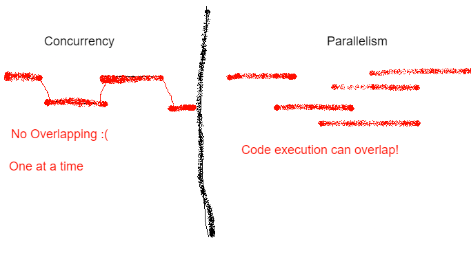

# Introduction 🏃🏽‍♀️
One of the best next steps you can take on your Python journey is diving into concurrency & parallelsim. Many developers will often learn enough to get by, 
but you can spend your entire career in this space! There are a lot of exciting things to learn, but newcomers can often feel intimadated by the steep curve. 
In this series of short posts I am hoping we can distill these topics so you can start writing more performant Python 🚀🐍  

&nbsp;


## Concurrency vs Parallelism
When starting out in this space, these two terms can often cause some confusion. So let's quickly define them:

| Paradigm      | Definition |
| ----------- | ----------- |
| Concurrency      | The process of interleaving individual tasks one at a time within bits of code (tasks being individual pieces of work i.e: adding together two numbers or sending a network request).|
| Parallelism   | Exectuing several or more bits of code at the same time.|  


For a more descriptive analogy. You can think of parallelism as a grocery store with multiple checkout lanes. 
Customers (the code) don't all have to use the same lane to have their goods processed. You can think of concurrency, as yourself! 
Maybe while you wait for your coffee to brew, you read the bird app, or while your code is building you go off and reply to emails  


If neither the analogy above or the table help illustrate the difference. Here is a crude MS Paint visualisation that might help (I meant to originally put more effort, but I kept procrastinating on this post so this is the best for now)  




&nbsp;

# CPU vs IO workloads
To fully take advantage of the performance benefits that come with concurrent/parallel code. You need to know when to use what technique. Luckily figuring out isn't too bad. 
Generally the advice for most situations goes like this:

- For CPU workloads, you'll want to use Parallelism/Processes&nbsp;

- For IO workloads, you'll want to use Concurrency/Threads

But what exactly is the distinction between these two workloads? Back to the terminology!

| Workload      | Definition |
| ----------- | ----------- |
| CPU      | Math, running methods on some data, physics simulation, running game AI/ML.       |
| IO   | Reading/Writing data from disk, web apps, APIs, sending/reciving network data.        |

&nbsp;

# Threads
You can think of threads as the most basic block of where computation occurs. All your code is ran on a thread (which is inside of a process), and while it isnt threads all the way down. You don't go any lower then this.


Quick example with threads: 
```python
import threading
import time

def thread_ripper_5000():
    time.sleep(2)
    print("Rip n Tear")

a = threading.Thread(target=thread_ripper_5000)
b = threading.Thread(target=thread_ripper_5000)
threads = [a, b]

for _thread in threads:
    _thread.start() # Have your thread start the computation

for _thread in threads:
    _thread.join() # Have our threads wrap up work
```

Python has a unique feature that is pretty uncommon in most languages. Only one thread runs at a time.... Which leads us to the next section.


## Oh My GIL 😱
The reason only one thread can run at a time in Python is thanks to the Global Interpreter Lock (GIL, also recall Python is an *interpretered* hence the name). While many cite the GIL as the source of all their problems, 
working with multiple threads in large applications is *hard*. Writing multithreaded code introduces a whole new slew of bugs such as data races, deadlocking, & heseinbugs. (However, it doesn't fully protect you. We'll explore this in later posts!)
The GIL is saving your future self a lot of time. 

So *true* multithreading is not really possible in Python, you can run multiple threads, but only one of them is ever actually doing anything at any given time. The rest idle by while its their time off the bench. However! You can still achieve parallel code execution, using **processes**! 

If you want to learn more about the GIL, check out: [Understanding the Python GIL by David Beazley](https://www.youtube.com/watch?v=Obt-vMVdM8s)
&nbsp; 

&nbsp;


### Sidebar: What is a Lock?
A **Lock** is a quite literally what it means. It is an object that ensures only one thread can do X thing at a time.(It "locks" sections of code so nobody else can reach it) Locks go far beyond the GIL! If you want to ensure only one thread (hint hint this is a future post 😉) writes to a file or data structure at a time, you can use a lock! You'll often hear locking referred to as **Mutual Exclusion**. 


# Processes
Every time you run Python it spawns its own *process*. The process handles state & lots of other things you the programmer doesn't need to worry about. As stated above each process comes with its own GIL. Plus with the `multiprocessing` library, you can spawn additional Python procceses in your code & give them code to execute

```python
import multiprocessing
import time

def process_ripper_5000():
    time.sleep(2)
    print("Process n Compute")

a = multiprocessing.Process(target=process_ripper_5000)
b = multiprocessing.Process(target=process_ripper_5000)
processes = [a, b]

for _process in processes:
    _process.start() # Have your process start the computation

for _process in processes:
    _process.join() # Have our process wrap up work
```
A good read on writing multiproccessing code: [Things I Wish They Told Me About Multiprocessing in Python](https://www.cloudcity.io/blog/2019/02/27/things-i-wish-they-told-me-about-multiprocessing-in-python/)


# Conclusion
This wraps up a brief introduction into the foundational vocabulary we'll need for future posts. This might seem simple (and it is!). There is a whole **LOT** I didn't mention or touch, but this introduction should aid in further or deeper dives into related subjects. 

To **review**:
- In any given Python process, **only one thread can run at a time due to the Global Interprter Lock (GIL)**
- Threads are *lightweight* and a **good** choice for I/O workloads
- Whenever you start a Python program it starts its own process with its own GIL. **You can spawn additional processes which are a good way to speed up CPU workloads**

In later posts we'll explore other topics such as concurrent.futures, asyncio, event loops, coroutines, getting past the GIL, and dive deeper into applications.


## Diving Deeper
Besides checking out the references below, if you want to dive deeper into what was covered here, try these ideas:
- Using the example from the Thread section, write some code that performs an I/O task such as getting weather data, reading/writing files, etc. 
- Using the example process code, trying mixing in some threading too! 
- Write a function that performs a mathematical sequence (Fibonacci is a popular one). Now write some code that runs the sequence using threads and another using processes. Which is faster? Why?


# References
- https://python.hamel.dev/concurrency/
- https://realpython.com/python-concurrency/
- https://www.geeksforgeeks.org/multiprocessing-python-set-1/
- https://realpython.com/intro-to-python-threading/
- https://www.cloudcity.io/blog/2019/02/27/things-i-wish-they-told-me-about-multiprocessing-in-python/
- https://www.youtube.com/watch?v=Obt-vMVdM8s


